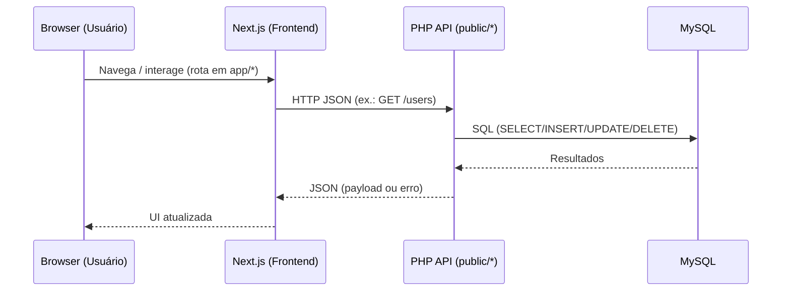
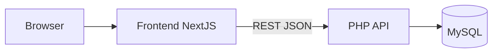

## Arquitetura de Software

### Visão geral
O projeto adota uma arquitetura em camadas com separação clara entre:
- Frontend (Next.js) para interface do usuário e navegação. 
- Backend (PHP) exposto como uma API REST JSON.
- Banco de dados relacional (MySQL) acessado via PDO no backend.

Em implantação, os componentes rodam como dois serviços independentes (frontend e backend) e se comunicam via HTTP. Em desenvolvimento local, o frontend consome o backend através da variável NEXT_PUBLIC_API_BASE_URL.

### Objetivos de arquitetura
- **Separação de preocupações**: desacoplar UI, regras de negócio e persistência.
- **Simplicidade operacional**: serviços independentes fáceis de subir localmente e em nuvem.
- **Evolutividade**: permitir evolução incremental de endpoints e telas sem reescrever o sistema.
- **Manutenibilidade**: módulos e pastas bem definidos; baixo acoplamento e alta coesão.
- **Portabilidade**: uso de padrões amplamente suportados (REST, MySQL, Docker).
- **Desempenho adequado**: consultas simples e resposta JSON leve para o escopo atual.

### Suposições de arquitetura
- O tráfego e a concorrência são moderados; não há requisitos de baixa latência extrema.
- O backend é stateless; sessão é tratada no cliente (token opaco) por ora.
- Não há necessidade de WebSockets/tempo real neste escopo inicial.
- Há um único banco MySQL; não há sharding nem replicação exigidos.
- O frontend acessa o backend por HTTP público com CORS liberado para a origem do frontend.
- O deploy acontece como dois serviços na nuvem (Render), cada um escalável de forma independente.

### Dependências consideradas
- Frontend: Next.js 16, React 19, Radix UI/Shadcn, Tailwind CSS, Zustand, Zod, date-fns, Recharts.
- Backend: PHP 8.2 com extensões `pdo`, `pdo_mysql`, `mysqli`.
- Banco: MySQL 8+ (compatível com o SQL do esquema).
- Ferramentas: Node.js, pnpm, Docker; Render para hospedagem.

### Requisitos relativos à arquitetura
- Funcionais (exemplos):
  - CRUD de usuários, times, projetos, sprints, backlog, tarefas e reuniões via API REST.
  - Autenticação por e-mail/senha e determinação de papéis (Developer/PO/SM/SuperAdmin).
- Não-funcionais:
  - Disponibilidade básica (serviços independentes e health checks).
  - Segurança mínima (CORS, HTTPS no front, credenciais via variáveis de ambiente).
  - Observabilidade inicial (tratamento de erros no front; health-check no backend).
  - Desempenho: tempos de resposta compatíveis com CRUD; paginação pode ser adicionada.
  - Manutenibilidade: estrutura de pastas clara e contratos simples em JSON.

### Estilo arquitetural
- **Frontend desacoplado + API REST**: a aplicação Next.js consome endpoints HTTP hospedados no backend PHP.
- **3 camadas lógicas**:
  - Apresentação: Next.js (App Router em `app/*`, componentes UI em `components/*`).
  - Serviços/API: PHP em `public/*` (ex.: `public/users/index.php`, `public/auth/login.php`).
  - Dados: MySQL, modelo de dados definido em `database/schema.sql` e acesso via `database/connection.php`.

### Decisões, restrições e justificativas
- Decisão: separar frontend e backend em serviços distintos → facilita escala/implantação e especialização de stack.
- Decisão: REST/JSON em vez de GraphQL → simplicidade e curva de aprendizado menor.
- Decisão: PDO nativo sem ORM → controle direto de SQL e menor overhead para CRUDs simples.
- Decisão: token opaco sem verificação server-side inicial → prioriza velocidade de entrega; pode evoluir para JWT.
- Restrição: sem jobs assíncronos ou filas neste escopo.
- Restrição: sem upload de arquivos e sem streaming.
- Restrição: uma única instância de banco (sem replicação).
- Justificativas: equipe familiarizada com PHP/Next.js; necessidade de entrega rápida; menor custo cognitivo.

### Componentes principais
- **Frontend (Next.js 16 + React 19)**
  - Rotas de páginas em `app/*` (ex.: `app/dashboard/page.tsx`, `app/users/page.tsx`).
  - Camada de acesso à API em `lib/api.ts` (define os paths e métodos HTTP).
  - Estado e utilitários em `lib/store.ts`, `lib/utils.ts`, `lib/types.ts`; UI com Radix/Shadcn em `components/ui/*`.
  - Variável `NEXT_PUBLIC_API_BASE_URL` define o host do backend (ex.: `http://localhost:8080` ou a URL do Render).

- **Backend (PHP 8.2)**
  - Endpoints REST na pasta `public/` (um arquivo por recurso: `users`, `projects`, `sprints`, `backlog`, `tasks`, `meetings`, `teams`, etc.).
  - CORS simples nos endpoints, entrada/saída JSON e verificação básica de métodos HTTP.
  - Conexão com MySQL centralizada em `database/connection.php` (PDO).
  - Scripts de ciclo de vida do banco: `database/setup.php`, `database/migrate.php`, `database/seed.php`.
  - Container Docker serve `public/` via servidor embutido do PHP.

- **Banco de Dados (MySQL)**
  - Esquema em `database/schema.sql` com entidades: `usuarios`, `product_owners`, `scrum_masters`, `membros_dev`, `times`, `projetos`, `sprints`, `itens_backlog`, `tarefas`, `reunioes`, etc.
  - Índices e chaves estrangeiras para garantir integridade referencial.

### Mecanismos de arquitetura
- **Configuração**: variáveis de ambiente (`DB_*`, `NEXT_PUBLIC_API_BASE_URL`).
- **Autenticação**: `POST /auth/login` retorna token opaco; papéis derivados de tabelas de papel.
- **Autorização (baseline)**: derivada de papéis; validações detalhadas podem ser adicionadas por endpoint.
- **CORS**: liberado de forma controlada no backend.
- **Tratamento de erros**: padronização básica no front (`lib/api.ts`) e HTTP status codes no backend.
- **Migração/seed**: scripts PHP em `database/*` para preparar o schema e dados.

### Abstrações de arquitetura
- **Camada de API do front**: `lib/api.ts` abstrai caminhos e métodos HTTP, reduzindo acoplamento das telas.
- **Camada de dados no back**: `Database::getConnection()` encapsula criação de conexões PDO.
- **Modelagem de domínio**: entidades (Usuário, Time, Projeto, Sprint, Item de Backlog, Tarefa, Reunião) refletidas nas tabelas.
- **Camada de apresentação**: componentes UI reutilizáveis em `components/*` e páginas em `app/*`.

### Perspectivas de arquitetura
- **Perspectiva lógica**: módulos de UI, API client, endpoints PHP e esquema relacional (seções acima).
- **Perspectiva de desenvolvimento**: organização por pastas (`app/*`, `components/*`, `public/*`, `database/*`, `lib/*`).
- **Perspectiva de processos (runtime)**: front chama REST do back; back consulta MySQL; ambos stateless.
- **Perspectiva de dados**: modelo relacional com chaves estrangeiras e índices (ver `database/schema.sql`).
- **Perspectiva de implantação**: dois serviços no Render; back em Docker (PHP), front em Node/Next (ver “Implantação”).

### Fluxo de requisições (alto nível)


### Diagrama de componentes


### Implantação
- Arquivo `render.yaml` define dois serviços:
  - Backend (PHP, `Dockerfile`), servindo `public/` e conectando ao MySQL via variáveis `DB_HOST`, `DB_PORT`, `DB_NAME`, `DB_USER`, `DB_PASS`.
  - Frontend (Node/Next), com build `pnpm build` e `pnpm start`.
- No serviço do frontend, configurar `NEXT_PUBLIC_API_BASE_URL` apontando para a URL pública do backend.

### Execução local (desenvolvimento)
1) Iniciar o backend (escolha uma das opções):
- PHP embutido:
```bash
php -S 0.0.0.0:8080 -t public
```
- Docker:
```bash
docker build -t backend-php .
docker run --rm -p 8080:8080 -e PORT=8080 \
  -e DB_HOST=127.0.0.1 -e DB_PORT=3306 \
  -e DB_NAME=scrum_db -e DB_USER=root -e DB_PASS= \
  backend-php
```
- Inicializar banco (se necessário):
```bash
php database/setup.php
php database/migrate.php
php database/seed.php
```

2) Iniciar o frontend:
```bash
export NEXT_PUBLIC_API_BASE_URL=http://localhost:8080
pnpm install
pnpm dev
```

### Impacto das ferramentas na arquitetura
- **Next.js/React**: produtividade e ecossistema de UI; SSR/ISR disponíveis se necessário; aumenta dependência de Node.
- **PHP 8.2**: curva de aprendizado baixa na equipe; fácil hospedagem; ideal para CRUDs; menos adequado para workloads altamente concorrentes sem camadas adicionais.
- **MySQL**: robusto e conhecido; bom suporte a relacionamentos; pode exigir otimização em consultas pesadas.
- **Docker/Render**: simplifica empacotamento e deploy; limitações de plano podem afetar escala/latência.
- **Zustand/Zod**: melhoram ergonomia de estado/validação no front; adicionam dependências, mas mantêm o código coeso.


